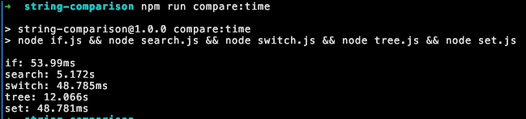
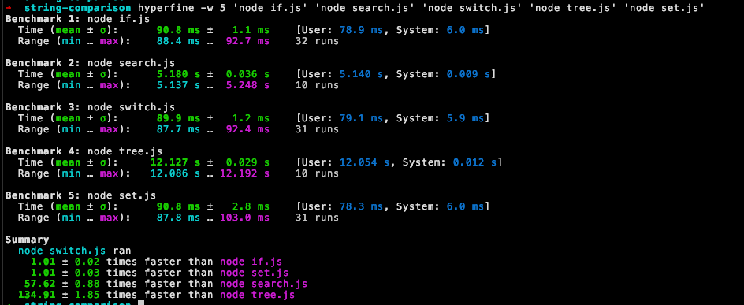

# String Comparison Benchmark

String comparison benchmark for method lookup

---

## Requirements

You will only need [Node.js](https://github.com/nodejs/node) and [hyperfine](https://github.com/sharkdp/hyperfine) optional

### Installation

- #### Node installation

Follow instruction [here](https://nodejs.org/en/download/package-manager)

- #### hyperfine installation

```bash
$ brew install hyperfine
```

## Usage

```bash
$ git clone https://github.com/dancastillo/string-comparison-benchmark
$ cd string-comparison-benchmark
```

## Running tests

Run and print out console.time for each method

```bash
$ npm run compare:test
```

Run with hyperfine

```bash
$ npm run compare:hyperfine
```

## Results

Results with `npm run compare:test`

Winner: `set`



Results with `npm run compare:hyperfine`

Winner: `switch`


